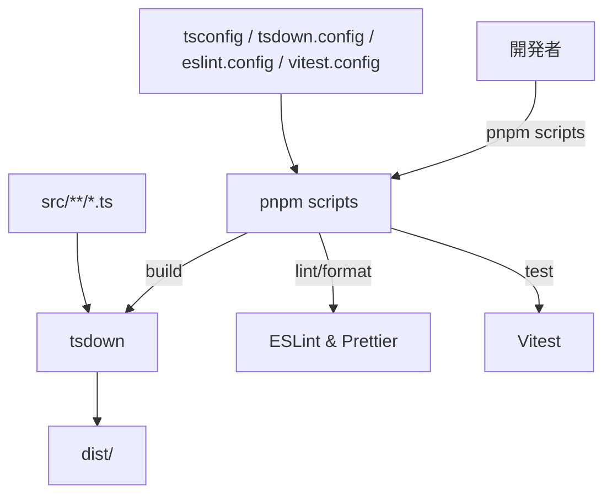
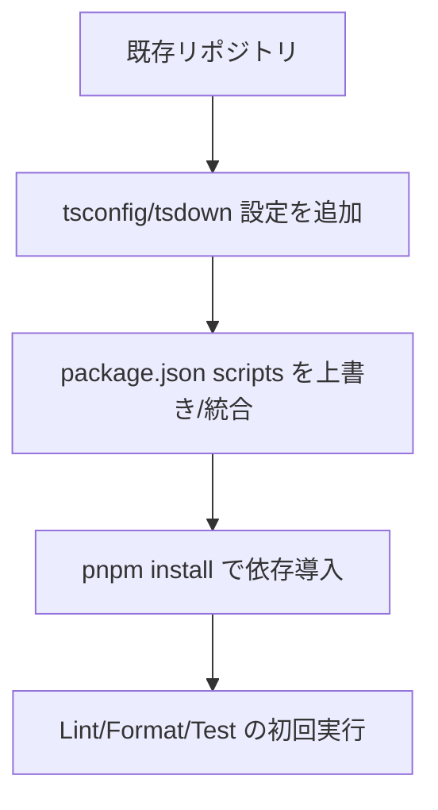

# Design Document

## Overview
本フィーチャーは、`mcp-screenshot-mac` プロジェクトのための TypeScript ESM CLI 開発環境を整備し、Node.js 24+ および Bun 1+ で即時にビルド・実行・テストが行える基盤を提供する。対象ユーザーは CLI パッケージを保守する開発者であり、依存導入や設定の初期段階で迷いなく開発を開始できる構成を目指す。これにより、後続の MCP 機能実装時に環境構築の手戻りが発生しない状態を実現する。

### Goals
- Node.js 24+/Bun 1+ で動作する pnpm 管理の TypeScript ESM CLI 雛形を用意する。
- tsdown を用いたビルドパイプラインと型定義出力を確実に機能させる。
- Flat ESLint・Prettier・Vitest を統合し、統一された品質基準とテスト実行を可能にする。

### Non-Goals
- MCP サーバーやスクリーンショット取得機能の実装は含めない。
- CLI 以外の配布形態（Electron など）の検討や設定は行わない。
- CI/CD 環境やリリースオートメーションの構築は対象外とする。

## Architecture

### High-Level Architecture
`pnpm` を基盤に、TypeScript ソース (`src/`) を tsdown で ESM へバンドルし、品質ツールは同じ依存管理下で実行する。開発者は npm scripts を通じてビルド・テスト・整形を呼び出し、`dist/` 出力を CLI バイナリ (`dist/cli.js`) として利用する。



### Technology Stack and Design Decisions
- **ランタイム**: Node.js >= 24.0.0, Bun >= 1.0.0（`engines` で強制）。
- **パッケージマネージャ**: pnpm v9 系。lockfile と scripts を通じて統制する。
- **ビルド**: tsdown により `src/index.ts` と `src/cli.ts` の 2 エントリを ESM + d.ts 出力。`banner` で shebang を付与し、`clean`・`sourcemap` を有効化。
- **型設定**: `tsconfig.json` は ESM CLI 向けに `moduleResolution: "bundler"`、`target: "ES2022"` を採用。
- **Lint/Format**: Flat ESLint (TypeScript ESLint + eslint-config-prettier) と Prettier。`eslint.config.mjs` が単一ソース。
- **テスト**: Vitest ESM 構成。`test/` 配下にサンプルテストを配置し、将来の実装にも対応可能とする。

#### Key Decisions
- **Decision**: バンドラーとして tsdown を採用する。
  - **Context**: TypeScript ESM CLI のビルドと型定義出力を統合的に管理する必要がある。
  - **Alternatives**: esbuild + tsc, tsup, rollup。
  - **Selected Approach**: tsdown を利用し、単一設定で JS と d.ts を生成。
  - **Rationale**: ESM 特化・型出力一体型・watch モードがあり、CLI 初期化要件に合致する。
  - **Trade-offs**: コミュニティ事例が少ないため、将来の拡張時はドキュメントを確認しつつ調整が必要。
- **Decision**: Flat ESLint 構成へ統一する。
  - **Context**: 最新 ESLint では Flat Config が推奨かつ設定が明瞭。
  - **Alternatives**: 従来の `.eslintrc` 形式、biome。
  - **Selected Approach**: `eslint.config.mjs` をルートに配置して Flat Config を採用。
  - **Rationale**: TypeScript サポートが成熟し、Prettier との競合解消も容易。
  - **Trade-offs**: 一部プラグインが Flat Config 未対応の場合の検証が必要。
- **Decision**: pnpm scripts に標準タスク (`dev`, `build`, `format`, `lint`, `test`, `ci`) を定義する。
  - **Context**: 複数ツールを統一的に呼び出すインターフェースが必要。
  - **Alternatives**: npm scripts, makefile。
  - **Selected Approach**: `package.json` scripts を pnpm 前提で整備。
  - **Rationale**: 一般的な Node CLI 開発フローに適合し、学習コストが低い。
  - **Trade-offs**: pnpm が前提となるため、他パッケージマネージャ利用時は対応が必要。

## Components and Interfaces

### Package 定義層

#### package.json
- **Responsibility & Boundaries**: プロジェクトメタデータ、npm scripts、依存と `engines` 制約を提供する。
- **Dependencies**:
  - **Inbound**: 開発者、CI ツール。
  - **Outbound**: npm registry、pnpm。
- **Contract**:
  - `scripts`: `build`, `dev`, `lint`, `format`, `format:check`, `test`, `test:watch`, `ci`。
  - `engines`: Node >= 24.0.0, Bun >= 1.0.0, pnpm >= 9.0.0。
  - `bin`: `mcp-screenshot-mac` -> `dist/cli.js`。

### ビルド層

#### tsdown.config.ts
- **Responsibility & Boundaries**: TypeScript ソースのバンドル戦略を定義する。
- **Dependencies**: `tsdown` パッケージ、`src/index.ts`, `src/cli.ts`。
- **Contract**:
  ```typescript
  export default defineConfig({
    entry: { index: 'src/index.ts', cli: 'src/cli.ts' },
    outDir: 'dist',
    format: ['esm'],
    dts: true,
    sourcemap: true,
    clean: true,
    banner: { js: '#!/usr/bin/env node' }
  })
  ```
- **Pre/Postconditions**: `dist/` がビルド開始前にクリアされ、完了後に `.js` と `.d.ts` が揃っている。

#### tsconfig.json
- **Responsibility & Boundaries**: TypeScript コンパイルオプションと解決規則を提供する。
- **Contract**: `compilerOptions` で `module: "ESNext"`, `moduleResolution: "bundler"`, `target: "ES2022"`, `strict: true`, `types: ["node"]` などを定義。

### 品質管理層

#### eslint.config.mjs
- **Responsibility & Boundaries**: Flat ESLint 設定を提供し、TypeScript 用ルールと Prettier 互換を適用する。
- **Dependencies**: `@typescript-eslint/eslint-plugin`, `@typescript-eslint/parser`, `eslint-config-prettier`。
- **Contract**:
  ```javascript
  export default [
    {
      ignores: ['dist'],
    },
    {
      files: ['**/*.ts'],
      languageOptions: {
        parser: tsParser,
        parserOptions: { projectService: true },
      },
      plugins: { '@typescript-eslint': tsPlugin },
      rules: {
        ...tsPlugin.configs['recommended-type-checked'].rules,
        '@typescript-eslint/explicit-module-boundary-types': 'off',
      },
    },
  ]
  ```

#### prettier.config.mjs
- **Responsibility & Boundaries**: コード整形ルールを提供。`semi: false`, `singleQuote: true`, `trailingComma: 'all'` 等チームの既定値を設定。

### テスト層

#### vitest.config.ts
- **Responsibility & Boundaries**: テスト実行対象と環境設定を提供する。
- **Contract**: `defineConfig({ test: { include: ['test/**/*.test.ts'], environment: 'node' } })`。

#### サンプルテスト (`test/smoke.test.ts`)
- **Responsibility & Boundaries**: テスト実行確認用の最小ケースを保持する（例: 真偽チェック）。
- **Dependencies**: Vitest API。
- **Contract**: `describe`/`it` 構造で CLI 初期化時の基本を確認。

## Error Handling
- `pnpm install`: `engines` によるバージョン検証不足時は pnpm が警告/エラーを出力するため、`engines` を正しく設定してトリガーさせる。
- `pnpm run build`: tsdown 失敗時はプロセスを失敗コードで終了。特別な再試行は必要なく、`sourcemap` により原因追跡を補助する。
- `pnpm run lint`/`test`: 失敗時は exit code 1 を返し、CI で検出可能。

## Testing Strategy
- **Unit Tests**: サンプルとして `test/smoke.test.ts` で `expect(true).toBe(true)` などの最小ケースを用意。将来はユーティリティ関数ごとにテスト追加。
- **Integration Tests**: CLI 実装が追加された段階で、`pnpm run build` 後のエントリポイント実行テストを追加予定（現段階では範囲外）。
- **Lint/Format チェック**: CI スクリプトで `pnpm run format:check` と `pnpm run lint` を連続実行。
- **開発フロー**: 開発者は `pnpm run dev`（tsdown watch）で変更即時ビルドを確認できるようにする。

## Security Considerations
- 現段階では外部 API や機密情報を扱わないため、高度な対策は不要。
- npm publish 時に不要ファイルが含まれないよう `files` フィールドを `['dist', 'package.json']` に限定する。

## Migration Strategy
初期構築であるため移行は不要。ただし既存プロジェクトへ導入する場合の最小手順を記しておく。



- 既存設定との競合がある場合は段階的に `eslint.config.mjs` や `prettier.config.mjs` をマージ。
- `pnpm install` 前に Node.js バージョンを 24 以上へ更新することを周知。
